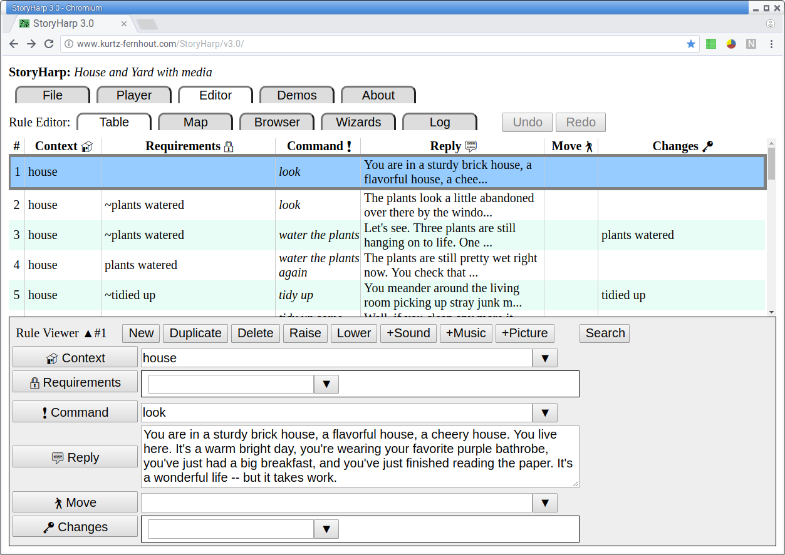

StoryHarp is a tool for authoring and playing Interactive Fiction adventure stories where the player picks from a list of choices.

StoryHarp 1.0 was originally a stand-alone desktop program in Delphi -- released in April 1998.

StoryHarp 2.0 was in Java but was not completed -- developed around 2011.

StoryHarp 3.0 is web-based using JavaScript/TypeScript, Mithril, and Tachyons -- released in April 2018 (as a twenty year anniversay edition).

You can try the web version here:
https://storyharp.com/v3.0/

For more background see: https://storyharp.com

StoryHarp 3.0 Copyright 1998-2025 Paul D. Fernhout and Cynthia F. Kurtz

StoryHarp is a trademark of Paul D. Fernhout and Cynthia F. Kurtz

